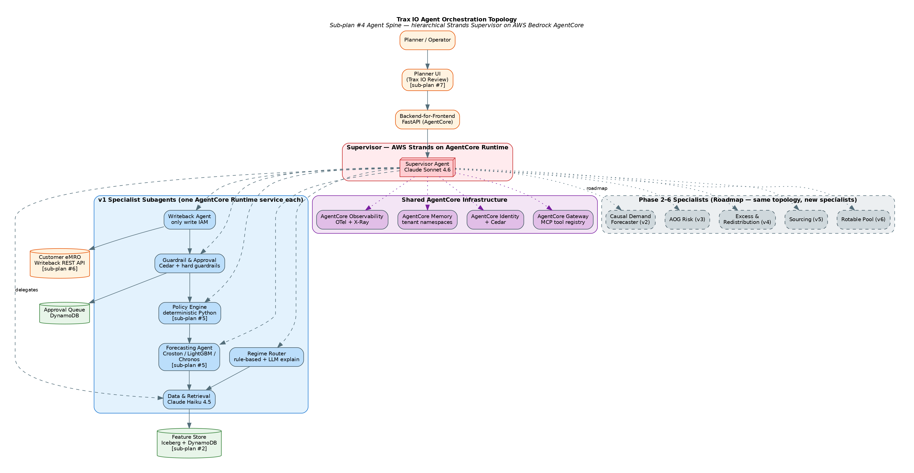
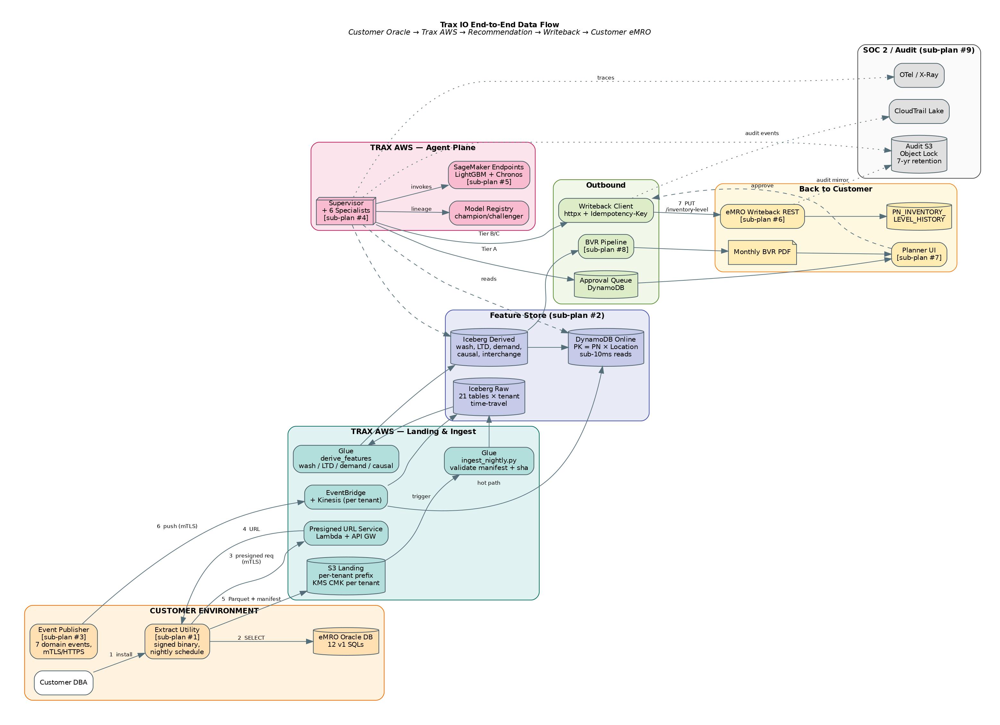

\newpage

# 1. Executive Summary

Trax IO is a multi-tenant AI inventory optimization agent layered on the Trax eMRO product. Version 1 targets the single highest-leverage decision in airline spares management: continuously recomputing `(ROP, EOQ, Safety Stock, Max)` per `PN × Location` under tiered autonomy, replacing the static values in `PN_INVENTORY_LEVEL` with policy-driven ones that react to utilization, wash rate drift, lead-time variance, and part criticality.

The product is built on AWS Bedrock AgentCore with a hierarchical agent topology orchestrated by AWS Strands, a regime-routed ensemble forecasting stack, and a deterministic non-LLM policy engine that produces the values written back to eMRO. The v1 design anticipates five subsequent phases — causal demand forecasting, AOG and shortage risk, excess and redistribution, repair-vs-buy sourcing, multi-echelon rotable pool sizing — and is explicitly architected so each phase adds one specialist subagent to the existing spine without re-architecting the platform.

Commercial posture is multi-tenant SaaS hosted in Trax's AWS, with tenant isolation enforced through per-tenant KMS keys, Cedar authorization policies, AgentCore Memory namespaces, and IAM role boundaries. SOC 2 Type II is baked into the control plane from day one. A monthly Business Value Report per tenant, productized in v1, is the contract-renewal engine and the mechanism that prevents the product from being perceived as a pilot that can be unplugged.

\newpage

# 2. Agent Orchestration Topology

The control plane is a single Supervisor agent built on AWS Strands, deployed on AgentCore Runtime. The Supervisor owns tenant context, session state, approval routing, and orchestration; it never performs domain work itself. It dispatches to six specialist subagents, each an independently-versioned AgentCore Runtime service.

The six v1 specialists are:

**Data & Retrieval Agent** — the only component that touches the feature store, eMRO extracts, and the event lane. All other agents read through it. One chokepoint for tenant isolation, query optimization, and caching.

**Regime Router Agent** — for each `PN × Location × Interchangeability-Group`, classifies into `ultra_rare | intermittent | moderate | high_volume`, selects the forecasting model, and emits the forecast request. Rule-based; LLM used only to explain regime transitions in the Planner UI.

**Forecasting Agent** — hosts the regime-specific models (classical intermittent, LightGBM, foundation-model challenger) behind a uniform distribution-returning interface. Delegates to SageMaker for inference.

**Policy Engine Agent** — deterministic Python, no LLM. Takes the forecast distribution, lead-time distribution, service-level target, cost structure, and hard constraints, and returns `(ROP, EOQ, SS, Max)` with full provenance. This is the layer planners sign off on.

**Guardrail & Approval Agent** — implements the three-tier autonomy model, enforces Cedar policies, routes out-of-band recommendations to human approval queues, and logs every decision. Backed by AgentCore Identity and Cedar.

**Writeback Agent** — the only agent with write permission into eMRO. Writes approved `PN_INVENTORY_LEVEL` changes, logs the delta to `PN_INVENTORY_LEVEL_HISTORY`, and handles rollback. Strictly scoped IAM role.

Phases 2–6 each add one specialist — Causal Demand Forecaster, AOG Risk, Excess & Redistribution, Sourcing, Rotable Pool — without touching the Supervisor's contract. This is the payoff for the hierarchical-from-day-1 investment.

\newpage

# 3. End-to-End Data Flow

The data plane has three ingress paths (nightly S3 extract, event-lane event publisher, optional DMS/CDC), a unified Iceberg + DynamoDB feature store, and a single writeback path back into customer eMRO. Tenant isolation is enforced at every boundary.

The nightly path is the workhorse. Each tenant lands a daily Oracle Data Pump extract into a tenant-scoped S3 prefix. The extracts materialize the twelve v1 SQLs as Parquet. An AWS Glue job validates the manifest and SHA-256 checksum, lands raw records in Apache Iceberg tables with time-travel enabled, and triggers derived-feature computation. Derived tables produce the feature vectors the agents actually consume — wash rate trends, lead-time distributions with promised-vs-actual deltas, demand history rolled to the interchangeability group, causal utilization by fleet and destination.

The event path ships as a Trax-authored eMRO add-on that emits seven domain events over HTTPS with mutual TLS to the Trax IO event endpoint. Events land on EventBridge, fan out to per-tenant Kinesis streams for Iceberg CDC materialization, and push incremental updates to DynamoDB. The event schema is versioned and contract-first.

A DynamoDB online layer serves sub-10-millisecond reads at event-time for the agent's hot paths. Iceberg handles the cold-path reads where a full demand history or interchangeability graph is needed.

\newpage

# 4. One Recommendation, End-to-End

When the Supervisor is invoked for a `(tenant, pn, location)`, the pipeline deterministically walks through the six specialists in sequence. The diagram below shows the control flow plus the audit mirror that captures every decision to S3 with Object Lock for seven-year retention.

The Guardrail & Approval Agent is the central governance point. It always evaluates the hard guardrails first — non-bypassable sanity checks like delta caps, floor constraints, shelf-life clamps, and open-AOG blocks. If any hard guardrail fires, the recommendation is rejected regardless of autonomy tier. If the tenant kill switch is engaged, everything is routed to the approval queue regardless of other criteria. Only after those two gates does the tier-resolver apply the `(essentiality × cost × delta × tenant_age)` decision matrix from the design.

The Writeback Agent is the only component in the entire system with `PN_INVENTORY_LEVEL:Write` IAM permission. Every write carries an idempotency key derived from `(date, tenant, pn, location)` to make retries safe. Writebacks against the eMRO Writeback REST API are transactional and logged to `PN_INVENTORY_LEVEL_HISTORY` inside the customer's own database, with a dual-book mirror to the Trax audit S3 bucket.

\newpage

# 5. Event Lane

The event lane is the mechanism that makes Trax IO responsive rather than merely scheduled. Nightly recomputes cover 95% of the catalog; the event lane handles the remaining 5% where minutes matter — airworthiness directives, sudden wash-rate spikes, vendor lead-time collapse, fleet changes.

The producer side is a Trax-authored eMRO add-on (sub-plan #3). Database triggers on six source tables populate an outbox table, which a Spring Boot drainer reads and pushes over mTLS-HTTPS to the Trax IO event endpoint. Retry exhaustion lands in a local dead-letter queue with an operator UI for replay.

The consumer side has three parallel fan-outs from the per-tenant Kinesis stream. A Glue streaming job materializes every event in an Iceberg CDC table for audit and replay. A Lambda consumer updates the DynamoDB online feature store incrementally. And an EventBridge-triggered Step Function fires "hot-parts" recomputes on the Agent Spine for AD-criticality `eo_published` events within five minutes of receipt.

The contract between the producer and consumer is frozen in the eMRO Outbound Event Publisher integration document and validated by shared contract tests running in both the eMRO and Trax IO repositories.

\newpage

# 6. Model Stack & Policy Engine

The forecasting stack is not one model — that strategy fails silently for the 60–75% of a typical airline catalog where demand is ultra-rare and zero-inflated. Trax IO ships a regime-routed ensemble feeding a deterministic policy engine. The ML is advisory; the policy math is what planners sign off on and what writes into eMRO.

**Regime Router.** Every `PN × Location × Interchangeability-Group` is classified nightly into one of four regimes based on demand density:

| Regime | Criterion | Typical share by count |
|---|---|---|
| `ultra_rare` | < 6 events in 24 months, OR < 90 days of history | 60–75% |
| `intermittent` | 6–24 events in 24 months | 15–25% |
| `moderate` | 25–200 events in 24 months | 5–10% |
| `high_volume` | > 200 events in 24 months | 1–5% (most demand volume) |

Router output is stored on the record and only re-classified when demand density crosses a hysteresis band of ±20% to prevent flapping.

**Forecasting models per regime.**

| Regime | Champion | Challenger (shadow) |
|---|---|---|
| `ultra_rare` | Compound-Poisson with empirical-Bayes peer priors | Chronos zero-shot |
| `intermittent` | Croston / TSB / SBA (auto-selected) | LightGBM with causal covariates |
| `moderate` | LightGBM with causal covariates | TSB as guardrail fallback |
| `high_volume` | LightGBM + foundation-model ensemble | Raw foundation model |

All models return a distribution — mean, variance, p50, p95, p99 — not a point forecast. The policy engine requires the full distribution because service-level math is inherently stochastic.

**Policy Engine.** Deterministic, pure Python, no LLM. Algorithm selection by regime:

- **Ultra-rare + high criticality** (tier 1–2) → one-for-one base-stock `(S−1, S)` with service level driven by the AOG cost model.
- **Intermittent** → `(s, S)` continuous-review with Wilson EOQ adjusted for lead-time-demand distribution.
- **Moderate + high-volume** → `(R, Q)` periodic-review aligned to the vendor review cycle, with `MinOQ` from `PN_VENDOR_PRICE` as a hard floor.

Interchangeability rollup is always applied before the policy calc; one-way chains honored. Shelf-life, hazmat, and tool-control flags cap Max Stock. Location hierarchy is honored as proto-multi-echelon in v1; full METRIC arrives in phase 6.

Every Policy Engine output includes a provenance record: model version, distribution parameters, service-level target, binding constraints, and the delta vs. current `PN_INVENTORY_LEVEL`. The provenance surfaces in the Planner UI and in the SOC 2 audit trail.

\newpage

# 7. Autonomy, Guardrails, and eMRO Integration Surface

Hybrid-by-part-class autonomy is enforced as Cedar policy at decision time by the Guardrail Agent, not as hard-coded rules. This means tenants can tune without code deploys.

**Tier A — Advisor only.** Recommendation lands in the eMRO review queue; planner reviews and approves; Writeback Agent writes. Default for essentiality tier 1, unit cost ≥ $10K, delta > 25%, first 90 days of tenant deployment, and any PN under active AOG investigation.

**Tier B — Bounded autonomy.** Agent writes within policy bands; out-of-band recommendations fall back to Tier A. Default for essentiality tier 2–3, delta within ±15%, unit cost < $10K. Tier B writes generate a 14-day visible planner notification with one-click rollback.

**Tier C — Autonomous with diff report.** Agent writes; planner sees a weekly digest. Default for essentiality tier 4–5 expendables and consumables, unit cost < $500, high-volume regime, delta within ±40%. This covers 60–70% of catalog by count — where most savings live.

Hard guardrails are never bypassed regardless of tier. Single-write delta is capped at 100% on every value. Floor constraints, shelf-life clamps, hazmat increase limits, open-order overflow checks, and the global AOG flag are always evaluated. The per-tenant kill switch reverts the agent to shadow mode within 60 seconds; the global kill switch covers all tenants within 5 minutes.

**Four integration contracts with eMRO.** Nightly extract utility (sub-plan #1), Outbound Event Publisher (sub-plan #3), Writeback REST API (sub-plan #6), and Planner UI "Trax IO Review" (sub-plan #7). Every write is transactional, logged to `PN_INVENTORY_LEVEL_HISTORY` inside the customer eMRO with the change source, agent version, forecast provenance, tier, and timestamp. Rollback window is 90 days, configurable but cannot be set to zero.

\newpage

# 8. Observability, SOC 2, and Tenant Isolation

Three observability surfaces share infrastructure but answer different questions. Operational observability answers "is the agent running?" via AgentCore Observability OpenTelemetry traces into AWS X-Ray, CloudWatch Logs + Metrics, and OpenSearch. Business observability answers "is the agent correct?" via a dedicated SageMaker + Glue evaluation pipeline scoring weighted MAPE, realized fill rate, savings attribution, planner override rate, and a composite planner trust score. Compliance observability answers "can we prove both to an auditor?" via CloudTrail Lake with seven-year retention, AWS Audit Manager running a pre-built SOC 2 framework, and an immutable per-tenant S3 audit bucket with Object Lock Compliance mode.

**Per-tenant cost attribution** is a first-class metric, tagged on every LLM invocation and SageMaker inference. Anomaly alerts fire before the monthly bill surprises anyone. This data also informs commercial pricing tiers.

**Monthly Business Value Report** is productized in v1 — not a nice-to-have. Auto-generated per tenant, rendered as a Trax-branded PDF, and posted to the Planner UI. This is the contract-renewal engine.

**Tenant isolation** is enforced at four layers:

1. **Contract layer** — every pydantic model carries `tenant_id`; every `Specialist` asserts the request's tenant matches the current `tenant_scope` context.
2. **Agent layer** — AgentCore Memory is namespaced per tenant; AgentCore Identity propagates tenant claim on every tool call; Cedar policies encode tenant as a principal attribute.
3. **Data layer** — Feature Store reads are filtered by `current_tenant()` in every method; per-tenant KMS CMKs; per-tenant Iceberg partitions and DynamoDB tables.
4. **Infrastructure layer** — Per-tenant CDK stacks; IAM boundaries; CloudTrail scopes; S3 Object Lock buckets.

A synthetic cross-tenant access attempt runs in every CI run; any success fails the build.

\newpage

# 9. ADR Highlights

Three architecturally-significant decisions anchor the v1 platform. Full ADRs live in `docs/adr/`.

**ADR-0001 — AWS Strands over LangGraph for the Supervisor.** Strands is native to AWS Bedrock AgentCore. AgentCore Memory, Identity, Gateway, and Observability wire up with zero glue code; LangGraph would cost months of bespoke adapter work. The orchestration we actually need is mostly LLM-driven dispatch, not explicit graph control. The trade-off is tighter Bedrock coupling; acceptable because Trax IO is a multi-tenant SaaS in Trax's AWS account by design. The deterministic orchestration (`SupervisorOrchestrator`) is kept framework-free so the Supervisor's entry-point can be rewritten as a single file if we ever migrate.

**ADR-0002 — In-memory FeatureStoreClient stub for Agent Spine.** The Spine defines a `FeatureStoreClient` Protocol with an `InMemoryFeatureStore` reference implementation; sub-plan #2 ships a `GlueIcebergFeatureStore` conforming to the same Protocol. The Spine team is unblocked on day one; lighthouse customer can pilot against the in-memory fake seeded with their own nightly extract while the production Feature Store ships. A shared contract test suite runs the same scenarios against both implementations in CI.

**ADR-0003 — `fake_emro` contract testing for the Writeback REST boundary.** The boundary between the Spine (Python on Bedrock) and eMRO (Java on Oracle) is the highest-blast-radius integration in the system. Mocking the client with `unittest.mock` is rejected — mocks pass when contracts drift. Instead, an OpenAPI 3.1 spec is the single source of truth; `fake_emro` (FastAPI) is the Trax-owned reference implementation; eMRO ships the Java implementation; both pass a shared contract test package and Schemathesis runs adversarial tests nightly. Drift is impossible to ignore.

\newpage

# 10. What is Explicitly Out of Scope for v1

Scope discipline was the single most-important planning choice. Feature creep at v1 is the fastest way to miss the lighthouse customer's window. Through v6 these items remain off-limits:

- Trax IO is **not a replacement** for eMRO's planning or procurement UIs. It recommends; eMRO records and executes.
- It is **not a general-purpose MRO chatbot**. The agent surface is scoped to inventory decisions; a broader "ask eMRO anything" agent is a separate product line.
- It is **not a demand-planning tool** for commercial scheduling. It consumes forward flight plans from OCC, it does not generate them.
- It is **not a replacement** for the airline's ERP. The write surface is `PN_INVENTORY_LEVEL` only.
- It is **not open-source**. The regime-routing heuristics, federated feature layer, and calibrated policy engine constitute the Trax moat.

v1 scope deferrals by phase: causal demand forecasting (v2), AOG and shortage risk agent (v3), excess and redistribution (v4), repair-vs-buy sourcing (v5), full multi-echelon METRIC rotable pool sizing (v6). Each phase is independently commercializable — customers can layer SKUs in any order, and a v1-only customer remains valid for the lifetime of the product.

\newpage

# Appendix A — Glossary

**AOG** — Aircraft On Ground. Revenue-impacting downtime, typically costed at $10K–$150K per hour depending on fleet and route.
**EOQ** — Economic Order Quantity.
**LRU** — Line Replaceable Unit. A rotable assembly.
**METRIC** — Multi-Echelon Technique for Recoverable Item Control. Canonical multi-echelon rotable optimization framework (RAND / USAF origin).
**PN** — Part Number.
**ROP** — Re-Order Point.
**SS** — Safety Stock.
**TAT** — Turnaround Time for a rotable in repair.
**TSB / SBA / Croston** — Classical intermittent-demand forecasting methods.

# Appendix B — Referenced eMRO Objects

`AC_ACTUAL_FLIGHTS`, `AC_MASTER`, `AC_PN_TRANSACTION_HISTORY`, `CUSTOMER_ORDER_DETAIL`, `CUSTOMER_ORDER_HEADER`, `DEFECT_REPORT`, `LOCATION_MASTER`, `NOTE_PAD`, `ORDER_DETAIL`, `ORDER_HEADER`, `ORDER_INVOICE`, `PLANNING`, `PN_EFFECTIVITY_DISTRIBUTION`, `PN_EFFECTIVITY_HEADER`, `PN_INTERCHANGEABLE`, `pn_interchg_one_way`, `PN_INVENTORY_DETAIL`, `PN_INVENTORY_HISTORY`, `PN_INVENTORY_LEVEL`, `PN_MASTER`, `PN_NEXT_LOWER_ASSEMBLY`, `PN_VENDOR_PRICE`, `RELATION_MASTER`, `REQUISITION_DETAIL`, `REQUISITION_HEADER`, `SYSTEM_TRAN_CODE`, `WO`, `WO_ENGINEERING_ORDER`.
