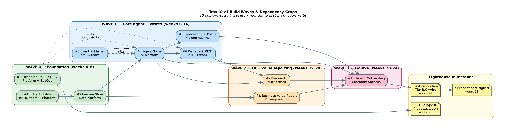
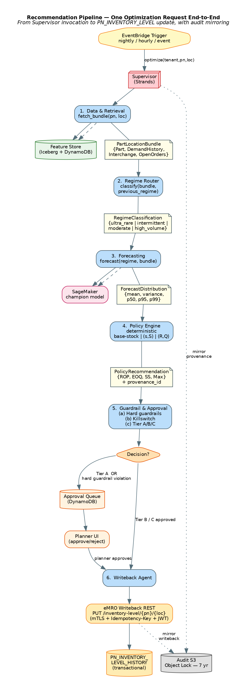
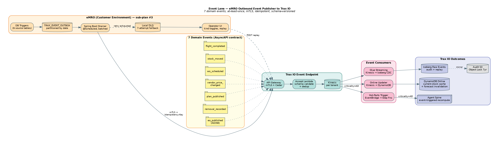
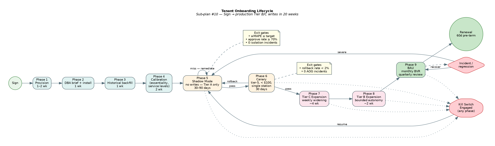

\newpage

# 1. Purpose

This guide is the operational companion to the Technical Architecture Guide. It orients an engineering lead, an engineering manager, or a newly-joined engineer on *what is being built, in what sequence, by whom, against which gates.* It does not repeat the architecture — for that, read the Architecture Guide first. It also does not replace the per-sub-plan TDD task lists — for those, see the `docs/plans/` folder. This guide is the connective tissue.

# 2. The 10 Sub-Projects

Trax IO v1 decomposes into ten sub-projects, each independently ticketable, each producing working testable software on its own. Dependencies are explicit and minimal.

| # | Sub-project | Repo / Stack | Owning team | Plan doc |
|---|---|---|---|---|
| 1 | Nightly Extract Utility | Python CLI, Oracle, S3 | eMRO team + Platform | `plans/2026-04-14-nightly-extract-utility-plan.md` |
| 2 | Feature Store & Data Lake | AWS Glue + Iceberg + DynamoDB | Data platform | `plans/2026-04-14-feature-store-plan.md` |
| 3 | eMRO Outbound Event Publisher | Java Spring Boot in eMRO | eMRO team + Platform | `plans/2026-04-14-event-publisher-plan.md` |
| 4 | Agent Spine | Python + Strands + AgentCore | AI platform | `plans/2026-04-14-agent-spine-implementation-plan.md` |
| 5 | Forecasting & Policy Engine | Python + SageMaker | ML engineering | `plans/2026-04-14-forecasting-policy-plan.md` |
| 6 | eMRO Writeback REST API | Java Spring Boot in eMRO | eMRO team | `plans/2026-04-14-writeback-rest-plan.md` |
| 7 | Planner UI "Trax IO Review" | eMRO frontend + FastAPI BFF | eMRO team | `plans/2026-04-14-planner-ui-plan.md` |
| 8 | Business Value Report Pipeline | Python + WeasyPrint + Glue | ML engineering | `plans/2026-04-14-bvr-pipeline-plan.md` |
| 9 | Observability + SOC 2 | AWS-native + Audit Manager | Platform + SecOps | `plans/2026-04-14-observability-soc2-plan.md` |
| 10 | Tenant Onboarding Runbook | Process + scripts | Customer Success | `plans/2026-04-14-tenant-onboarding-runbook.md` |

# 3. Build Waves

Ten sub-projects sequence into four build waves. Dependencies determine the sequencing — you cannot build the Agent Spine before the Feature Store has real data; you cannot ship the Planner UI before the Writeback REST exists.

**Wave 0 — Foundation (weeks 0–6).** #1 Extract Utility, #2 Feature Store, and #9 Observability + SOC 2 start day one, in parallel. Wave 0 exit: first tenant's nightly extract running clean for 14 days; Feature Store Iceberg tables backfilled for that tenant; CloudTrail Lake event store live; AWS Audit Manager SOC 2 framework attached.

**Wave 1 — Core agent + write path (weeks 6–16).** #4 Agent Spine, #5 Forecasting & Policy, #3 Event Publisher, #6 Writeback REST. This is the wave that turns data into decisions and decisions into writes. Wave 1 exit: Agent Spine produces real recommendations against real data; Forecasting champion/challenger evaluation pipeline running nightly; eMRO Writeback REST deployed in lighthouse customer's eMRO; first end-to-end shadow-mode write against `fake_emro` and the real eMRO endpoint.

**Wave 2 — UI + value reporting (weeks 12–20).** #7 Planner UI, #8 Business Value Report Pipeline. Overlaps with Wave 1. Wave 2 exit: Planner UI embedded in lighthouse eMRO instance; first month of Business Value Report PDF auto-generated and posted to Planner UI.

**Wave 3 — Go-live (weeks 20–24).** #10 Tenant Onboarding. Exit: lighthouse tenant exits shadow mode; first Tier B/C writes in production; second tenant signed and onboarding queued.

# 4. Critical Path & Load-Bearing Items

The single most-load-bearing item on the critical path is **#2 Feature Store**. Every downstream sub-project depends on it. Staff it with your strongest data engineer and treat its Phase 1 (Iceberg raw schemas + nightly ingest Glue job) as a hard gate — the whole organization waits on it.

The second most-load-bearing item is **SOC 2 Type II starting day one (sub-plan #9).** Retroactive SOC 2 evidence is impossible. Every CloudTrail event from week 1 matters for the first attestation.

Within sub-plan #4 Agent Spine, the most-load-bearing item is **Phase 7 (Policy Engine).** It is pure Python, highly testable, and the piece planners will actually sign off on. Front-load it onto the strongest engineer on the team.

Within sub-plan #5, the Policy Engine math (Phase 7) similarly front-loads — statistical accuracy bugs in base-stock / (s,S) / (R,Q) cascade silently into wrong stock levels.

# 5. Team Composition & Assignments

The minimum viable team for v1 is roughly 9–10 FTEs across the first two quarters, scaling to ~12 with the SOC 2 attestation push.

**AI Platform team (3.0 FTE)** — Agent Spine lead + 2 Python engineers + SRE (shared). Owns sub-plan #4 and the Trax-side of sub-plans #3, #6, #7 integration (BFF, contract tests, schema docs).

**ML Engineering team (3.5 FTE)** — ML lead + 2 ML engineers + ML platform engineer + 0.5 statistician consultant. Owns sub-plan #5 Forecasting & Policy, sub-plan #8 BVR pipeline, and the evaluation pipeline integration into sub-plan #9.

**Data Platform team (2.5 FTE)** — Data platform lead + 2 data engineers + 0.5 SRE. Owns sub-plan #2 Feature Store and sub-plan #1's presigned-URL service.

**eMRO Product team (2 eMRO engineers + 0.5 frontend)** — owns the Java + frontend portions of sub-plans #1, #3, #6, #7. Sequentially, not in parallel.

**Platform & SecOps (1.5 FTE)** — 1 platform observability lead + 1 SRE + 1 SecOps engineer. Owns sub-plan #9.

**Customer Success (1 FTE)** — dedicated customer success lead per onboarding tenant, starting week 14. Owns sub-plan #10.

# 6. Lighthouse Customer Milestones

The lighthouse customer pilot is not a "nice-to-have demo" — it's the commercial vehicle that de-risks v1 and funds v2. The schedule below assumes the lighthouse customer is signed before Week 0.

| Week | Milestone | Owner |
|---|---|---|
| 0 | Lighthouse customer signed for shadow-mode pilot | Sales + Innovation |
| 2 | Customer's nightly extract runs clean against pilot dataset | eMRO team + customer DBA |
| 4 | Feature Store backfilled with 24 months of customer history | Data platform |
| 8 | First Agent Spine recommendation produced (stub forecaster) | AI platform |
| 12 | Real Forecasting & Policy stack producing recommendations | ML engineering |
| 14 | Planner UI deployed in customer's eMRO; planner uses it to review | eMRO team + customer planning lead |
| 16 | Shadow-mode telemetry: agent recommendations vs. planner decisions | ML engineering |
| 20 | First Business Value Report delivered | ML engineering |
| 24 | First production Tier B/C writes (non-critical expendables) | Customer success |
| 26 | First SOC 2 Type II attestation complete | SecOps |
| 28 | Second customer signed; v1.1 scope locked | Sales + Innovation |

# 7. One Recommendation, End-to-End

For an engineer orienting on the system, the single most-useful diagram is the recommendation pipeline — what happens, step by step, when the Supervisor is invoked for a single `(tenant, pn, location)` optimization request.

Execution is deterministic: Data → Regime → Forecast → Policy → Guardrail → (Queue OR Writeback) → Audit. The Guardrail Agent is where governance is enforced; the Writeback Agent is the only component allowed to mutate `PN_INVENTORY_LEVEL`. Every step emits OTel spans tagged with tenant, session, and provenance ID; every decision is mirrored to the immutable audit bucket.

# 8. Event Lane

The event lane handles real-time responsiveness — the 5% of changes where minutes matter. Airworthiness directives, sudden wash-rate spikes, vendor lead-time collapse, fleet changes. For an engineer working on sub-plans #3 or #4, this diagram is the operational reference.

The producer-side plumbing (DB triggers, outbox, drainer, DLQ, operator UI) is built once per eMRO release and inherited by every customer. The consumer-side plumbing (API Gateway, Lambda, Kinesis, three parallel fan-outs) lives in Trax IO's AWS account and is multi-tenant-scoped at every layer.

The contract between producer and consumer is frozen in `docs/contracts/2026-04-14-emro-event-publisher-contract.md`. Changes require a joint eMRO + Trax IO review and a semver bump; breaking changes require a full eMRO release cycle deprecation window.

# 9. Tenant Onboarding Lifecycle

A tenant moves from contract signature to production writes through nine phases, each with measurable exit criteria. Sub-plan #10 codifies this as an operational runbook; this diagram is the mental model.

The product's single most-important risk mitigation is **Phase 5 Shadow Mode**. Every new tenant spends 30–90 days with every recommendation forced to Tier A (no writes). Exit requires weighted MAPE ≤ tenant target, planner "would approve" rate ≥ 70%, zero isolation incidents, and explicit planner sign-off.

Phase 6 Canary is the narrow first slice of real writes — tier-5 consumables under $100, single station only. 30 days clean with rollback rate < 2% and zero AOG incidents before expanding.

Phases 7 and 8 (Tier C and Tier B expansions) follow a weekly widening schedule. Each weekly gate requires clean metrics from the prior week. Any regression rolls back to the prior phase rather than forcing forward. "We will not break the customer for schedule reasons" is a hard rule.

Kill switches cut across every phase: per-tenant reverts the agent to shadow mode within 60 seconds; global covers all tenants within 5 minutes.

# 10. Cross-Cutting Concerns

Every engineer in every sub-plan needs to internalize these.

**Tenant isolation** is the single highest-stakes invariant. Enforced at the contract layer (`TenantContext` propagation), the agent layer (`Specialist._assert_tenant_match`), the data layer (Feature Store namespaces + KMS), and the infrastructure layer (per-tenant CDK stacks). Synthetic cross-tenant access attempts run in every CI run; any success fails the build.

**SOC 2 evidence** is not a post-hoc audit — it is the way the platform is built. Every sub-plan's CI gate includes observability lint verifying expected tenant-tagged spans, cost records, and audit events. CloudTrail tags, KMS envelope encryption, and audit-log emission are non-negotiable.

**Contract-first integrations.** The four integrations with eMRO (Extract, Event Publisher, Writeback REST, Planner UI) and the two internal cross-team boundaries (Feature Store Protocol, Forecasting/Policy Protocol) are all governed by versioned contracts and shared test packages. Drift fails CI in both repos.

**Prompt injection defense.** Free-text eMRO fields (`REMOVAL_REASON`, `DemandNote`, etc.) are mechanic-authored and treated as untrusted. Defensive prompt construction; strict tool-use scopes; v1 red-team suite includes injection payloads in the evaluation corpus.

**Bedrock cost observability.** Multi-tenant SaaS on a reasoning-heavy agent stack can surprise the P&L. Per-tenant cost is a first-class metric, tagged on every LLM invocation and SageMaker inference. Anomaly alerts fire before the monthly bill surprises anyone.

# 11. Risk Register

| Risk | Likelihood | Impact | Mitigation |
|---|---|---|---|
| Customer DBA refuses Trax-signed extract utility | Medium | High | Pre-approved security review package; DMS/CDC fallback path |
| Forward flight plan integration (v2) blocked | High | Medium | Begin OCC integration scoping at Wave 1 |
| Bedrock cost ceiling breached | Medium | High | Per-tenant cost ledger from day one; commercial contract overage pricing |
| Long-tail forecast quality regresses | High | High | Empirical-Bayes priors + FM challenger; fallback to static `PN_INVENTORY_LEVEL` |
| Planner trust collapses | Medium | High | Trust-score telemetry; calibration consulting in onboarding |
| eMRO release train slips, missing #3/#6/#7 window | Medium | High | Two-release-train plan: #3 and #6/#7 decoupled |
| Prompt injection via free-text fields | Medium | Medium | Red-team suite; defensive prompt construction |
| Lighthouse customer departs before Tier B/C | Low | Critical | Monthly BVR anchors retention; second tenant by week 28 |

# 12. Success Criteria for v1

- Lighthouse tenant in shadow mode within two quarters of plan approval.
- Ninety days of shadow-mode telemetry showing agent recommendations at least as good as planner decisions on weighted MAPE and cost.
- First Tier B/C writes on tier-4 expendables within one month of shadow exit.
- First monthly Business Value Report delivered within 30 days of first production writes.
- SOC 2 Type II first attestation complete before the lighthouse exits shadow.
- Second tenant signed before v1.1 scope locks.
